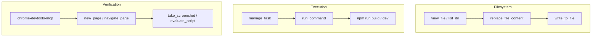

<!-- intent-skills:start -->
# TanStack Intent - before editing files, run the matching guidance command.
tanstackIntent:
  - id: "@tanstack/devtools#devtools-app-setup"
    run: "npx @tanstack/intent@latest load @tanstack/devtools#devtools-app-setup"
    for: "Install TanStack Devtools, pick framework adapter (React/Vue/Solid/Preact), register plugins via plugins prop, configure shell (position, hotkeys, theme, hideUntilHover, requireUrlFlag, eventBusConfig). TanStackDevtools component, defaultOpen, localStorage persistence."
  - id: "@tanstack/devtools#devtools-marketplace"
    run: "npx @tanstack/intent@latest load @tanstack/devtools#devtools-marketplace"
    for: "Publish plugin to npm and submit to TanStack Devtools Marketplace. PluginMetadata registry format, plugin-registry.ts, pluginImport (importName, type), requires (packageName, minVersion), framework tagging, multi-framework submissions, featured plugins."
  - id: "@tanstack/devtools#devtools-plugin-panel"
    run: "npx @tanstack/intent@latest load @tanstack/devtools#devtools-plugin-panel"
    for: "Build devtools panel components that display emitted event data. Listen via EventClient.on(), handle theme (light/dark), use @tanstack/devtools-ui components. Plugin registration (name, render, id, defaultOpen), lifecycle (mount, activate, destroy), max 3 active plugins. Two paths: Solid.js core with devtools-ui for multi-framework support, or framework-specific panels."
  - id: "@tanstack/devtools#devtools-production"
    run: "npx @tanstack/intent@latest load @tanstack/devtools#devtools-production"
    for: "Handle devtools in production vs development. removeDevtoolsOnBuild, devDependency vs regular dependency, conditional imports, NoOp plugin variants for tree-shaking, non-Vite production exclusion patterns."
  - id: "@tanstack/devtools-event-client#devtools-bidirectional"
    run: "npx @tanstack/intent@latest load @tanstack/devtools-event-client#devtools-bidirectional"
    for: "Two-way event patterns between devtools panel and application. App-to-devtools observation, devtools-to-app commands, time-travel debugging with snapshots and revert. structuredClone for snapshot safety, distinct event suffixes for observation vs commands, serializable payloads only."
  - id: "@tanstack/devtools-event-client#devtools-event-client"
    run: "npx @tanstack/intent@latest load @tanstack/devtools-event-client#devtools-event-client"
    for: "Create typed EventClient for a library. Define event maps with typed payloads, pluginId auto-prepend namespacing, emit()/on()/onAll()/onAllPluginEvents() API. Connection lifecycle (5 retries, 300ms), event queuing, enabled/disabled state, SSR fallbacks, singleton pattern. Unique pluginId requirement to avoid event collisions."
  - id: "@tanstack/devtools-event-client#devtools-instrumentation"
    run: "npx @tanstack/intent@latest load @tanstack/devtools-event-client#devtools-instrumentation"
    for: "Analyze library codebase for critical architecture and debugging points, add strategic event emissions. Identify middleware boundaries, state transitions, lifecycle hooks. Consolidate events (1 not 15), debounce high-frequency updates, DRY shared payload fields, guard emit() for production. Transparent server/client event bridging."
  - id: "@tanstack/devtools-vite#devtools-vite-plugin"
    run: "npx @tanstack/intent@latest load @tanstack/devtools-vite#devtools-vite-plugin"
    for: "Configure @tanstack/devtools-vite for source inspection (data-tsd-source, inspectHotkey, ignore patterns), console piping (client-to-server, server-to-client, levels), enhanced logging, server event bus (port, host, HTTPS), production stripping (removeDevtoolsOnBuild), editor integration (launch-editor, custom editor.open). Must be FIRST plugin in Vite config. Vite ^6 || ^7 only."
  - id: "@tanstack/react-start#lifecycle/migrate-from-nextjs"
    run: "npx @tanstack/intent@latest load @tanstack/react-start#lifecycle/migrate-from-nextjs"
    for: "Step-by-step migration from Next.js App Router to TanStack Start: route definition conversion, API mapping, server function conversion from Server Actions, middleware conversion, data fetching pattern changes."
  - id: "@tanstack/react-start#react-start"
    run: "npx @tanstack/intent@latest load @tanstack/react-start#react-start"
    for: "React bindings for TanStack Start: createStart, StartClient, StartServer, React-specific imports, re-exports from @tanstack/react-router, full project setup with React, useServerFn hook."
  - id: "@tanstack/react-start#react-start/server-components"
    run: "npx @tanstack/intent@latest load @tanstack/react-start#react-start/server-components"
    for: "Implement, review, debug, and refactor TanStack Start React Server Components in React 19 apps. Use when tasks mention @tanstack/react-start/rsc, renderServerComponent, createCompositeComponent, CompositeComponent, renderToReadableStream, createFromReadableStream, createFromFetch, Composite Components, React Flight streams, loader or query owned RSC caching, router.invalidate, structuralSharing: false, selective SSR, stale names like renderRsc or .validator, or migration from Next App Router RSC patterns. Do not use for generic SSR or non-TanStack RSC frameworks except brief comparison."
  - id: "@tanstack/router-core#router-core"
    run: "npx @tanstack/intent@latest load @tanstack/router-core#router-core"
    for: "Framework-agnostic core concepts for TanStack Router: route trees, createRouter, createRoute, createRootRoute, createRootRouteWithContext, addChildren, Register type declaration, route matching, route sorting, file naming conventions. Entry point for all router skills."
  - id: "@tanstack/router-core#router-core/auth-and-guards"
    run: "npx @tanstack/intent@latest load @tanstack/router-core#router-core/auth-and-guards"
    for: "Route protection with beforeLoad, redirect()/throw redirect(), isRedirect helper, authenticated layout routes (_authenticated), non-redirect auth (inline login), RBAC with roles and permissions, auth provider integration (Auth0, Clerk, Supabase), router context for auth state."
  - id: "@tanstack/router-core#router-core/code-splitting"
    run: "npx @tanstack/intent@latest load @tanstack/router-core#router-core/code-splitting"
    for: "Automatic code splitting (autoCodeSplitting), .lazy.tsx convention, createLazyFileRoute, createLazyRoute, lazyRouteComponent, getRouteApi for typed hooks in split files, codeSplitGroupings per-route override, splitBehavior programmatic config, critical vs non-critical properties."
  - id: "@tanstack/router-core#router-core/data-loading"
    run: "npx @tanstack/intent@latest load @tanstack/router-core#router-core/data-loading"
    for: "Route loader option, loaderDeps for cache keys, staleTime/gcTime/ defaultPreloadStaleTime SWR caching, pendingComponent/pendingMs/ pendingMinMs, errorComponent/onError/onCatch, beforeLoad, router context and createRootRouteWithContext DI pattern, router.invalidate, Await component, deferred data loading with unawaited promises."
  - id: "@tanstack/router-core#router-core/navigation"
    run: "npx @tanstack/intent@latest load @tanstack/router-core#router-core/navigation"
    for: "Link component, useNavigate, Navigate component, router.navigate, ToOptions/NavigateOptions/LinkOptions, from/to relative navigation, activeOptions/activeProps, preloading (intent/viewport/render), preloadDelay, navigation blocking (useBlocker, Block), createLink, linkOptions helper, scroll restoration, MatchRoute."
  - id: "@tanstack/router-core#router-core/not-found-and-errors"
    run: "npx @tanstack/intent@latest load @tanstack/router-core#router-core/not-found-and-errors"
    for: "notFound() function, notFoundComponent, defaultNotFoundComponent, notFoundMode (fuzzy/root), errorComponent, CatchBoundary, CatchNotFound, isNotFound, NotFoundRoute (deprecated), route masking (mask option, createRouteMask, unmaskOnReload)."
  - id: "@tanstack/router-core#router-core/path-params"
    run: "npx @tanstack/intent@latest load @tanstack/router-core#router-core/path-params"
    for: "Dynamic path segments ($paramName), splat routes ($ / _splat), optional params ({-$paramName}), prefix/suffix patterns ({$param}.ext), useParams, params.parse/stringify, pathParamsAllowedCharacters, i18n locale patterns."
  - id: "@tanstack/router-core#router-core/search-params"
    run: "npx @tanstack/intent@latest load @tanstack/router-core#router-core/search-params"
    for: "validateSearch, search param validation with Zod/Valibot/ArkType adapters, fallback(), search middlewares (retainSearchParams, stripSearchParams), custom serialization (parseSearch, stringifySearch), search param inheritance, loaderDeps for cache keys, reading and writing search params."
  - id: "@tanstack/router-core#router-core/ssr"
    run: "npx @tanstack/intent@latest load @tanstack/router-core#router-core/ssr"
    for: "Non-streaming and streaming SSR, RouterClient/RouterServer, renderRouterToString/renderRouterToStream, createRequestHandler, defaultRenderHandler/defaultStreamHandler, HeadContent/Scripts components, head route option (meta/links/styles/scripts), ScriptOnce, automatic loader dehydration/hydration, memory history on server, data serialization, document head management."
  - id: "@tanstack/router-core#router-core/type-safety"
    run: "npx @tanstack/intent@latest load @tanstack/router-core#router-core/type-safety"
    for: "Full type inference philosophy (never cast, never annotate inferred values), Register module declaration, from narrowing on hooks and Link, strict:false for shared components, getRouteApi for code-split typed access, addChildren with object syntax for TS perf, LinkProps and ValidateLinkOptions type utilities, as const satisfies pattern."
  - id: "@tanstack/router-plugin#router-plugin"
    run: "npx @tanstack/intent@latest load @tanstack/router-plugin#router-plugin"
    for: "TanStack Router bundler plugin for route generation and automatic code splitting. Supports Vite, Webpack, Rspack, and esbuild. Configures autoCodeSplitting, routesDirectory, target framework, and code split groupings."
  - id: "@tanstack/start-client-core#start-core"
    run: "npx @tanstack/intent@latest load @tanstack/start-client-core#start-core"
    for: "Core overview for TanStack Start: tanstackStart() Vite plugin, getRouter() factory, root route document shell (HeadContent, Scripts, Outlet), client/server entry points, routeTree.gen.ts, tsconfig configuration. Entry point for all Start skills."
  - id: "@tanstack/start-client-core#start-core/auth-server-primitives"
    run: "npx @tanstack/intent@latest load @tanstack/start-client-core#start-core/auth-server-primitives"
    for: "Server-side authentication primitives for TanStack Start: session cookies (HttpOnly, Secure, SameSite, __Host- prefix), session read/issue/destroy via createServerFn and middleware, OAuth authorization-code flow with state and PKCE, password-reset enumeration defense, CSRF for non-GET RPCs, rate limiting auth endpoints, session rotation on privilege change. Pairs with router-core/auth-and-guards for the routing side."
  - id: "@tanstack/start-client-core#start-core/deployment"
    run: "npx @tanstack/intent@latest load @tanstack/start-client-core#start-core/deployment"
    for: "Deploy to Cloudflare Workers, Netlify, Vercel, Node.js/Docker, Bun, Railway. Selective SSR (ssr option per route), SPA mode, static prerendering, ISR with Cache-Control headers, SEO and head management."
  - id: "@tanstack/start-client-core#start-core/execution-model"
    run: "npx @tanstack/intent@latest load @tanstack/start-client-core#start-core/execution-model"
    for: "Isomorphic-by-default principle, environment boundary functions (createServerFn, createServerOnlyFn, createClientOnlyFn, createIsomorphicFn), ClientOnly component, useHydrated hook, import protection, dead code elimination, environment variable safety (VITE_ prefix, process.env)."
  - id: "@tanstack/start-client-core#start-core/middleware"
    run: "npx @tanstack/intent@latest load @tanstack/start-client-core#start-core/middleware"
    for: "createMiddleware, request middleware (.server only), server function middleware (.client + .server), context passing via next({ context }), sendContext for client-server transfer, global middleware via createStart in src/start.ts, middleware factories, method order enforcement, fetch override precedence."
  - id: "@tanstack/start-client-core#start-core/server-functions"
    run: "npx @tanstack/intent@latest load @tanstack/start-client-core#start-core/server-functions"
    for: "createServerFn (GET/POST), validator (Zod or function), useServerFn hook, server context utilities (getRequest, getRequestHeader, setResponseHeader, setResponseStatus), error handling (throw errors, redirect, notFound), streaming, FormData handling, file organization (.functions.ts, .server.ts)."
  - id: "@tanstack/start-client-core#start-core/server-routes"
    run: "npx @tanstack/intent@latest load @tanstack/start-client-core#start-core/server-routes"
    for: "Server-side API endpoints using the server property on createFileRoute, HTTP method handlers (GET, POST, PUT, DELETE), createHandlers for per-handler middleware, handler context (request, params, context), request body parsing, response helpers, file naming for API routes."
  - id: "@tanstack/start-server-core#start-server-core"
    run: "npx @tanstack/intent@latest load @tanstack/start-server-core#start-server-core"
    for: "Server-side runtime for TanStack Start: createStartHandler, request/response utilities (getRequest, setResponseHeader, setCookie, getCookie, useSession), three-phase request handling, AsyncLocalStorage context."
  - id: "@tanstack/virtual-file-routes#virtual-file-routes"
    run: "npx @tanstack/intent@latest load @tanstack/virtual-file-routes#virtual-file-routes"
    for: "Programmatic route tree building as an alternative to filesystem conventions: rootRoute, index, route, layout, physical, defineVirtualSubtreeConfig. Use with TanStack Router plugin's virtualRouteConfig option."
<!-- intent-skills:end -->

---

# Developer Agent System Documentation

Welcome! This documentation details the system flow, architecture, design patterns, technologies, and AI tools governing the development and runtime execution of the **Arun Jojo - Personal Portfolio SPA** website.

---

## 1. System Overview & Technology Stack

The application is a full-featured, static-rendered portfolio SPA built using a modern full-stack web stack:

### Core Frameworks
*   **React 19:** Utilizing the latest rendering engine, support for concurrent features, and clean component architecture.
*   **TypeScript:** Enforcing rigid type-safety across routes, translation schemas, and component interfaces.
*   **TanStack Start:** Built on top of TanStack Router and Vite, managing the isomorphic application lifecycle, client-server hydration boundaries, and physical file-based routing.
*   **Tailwind CSS v4:** Providing utility-first styling with native CSS variables and dynamic compiler performance.

### Project Directory Structure
```text
personal-portfolio/
├── public/                 # Static asset delivery
│   ├── docs/resume.pdf     # Extracted PDF Resume
│   └── images/portrait.jpg # Profile Photo
├── src/                    # Application source code
│   ├── components/         # Shared & layout components
│   │   ├── Header.tsx      # Navigation header & Language select
│   │   ├── Footer.tsx      # Translated copyright footer
│   │   ├── ThemeToggle.tsx # Dark/Light theme selector
│   │   └── portfolio/      # Refactored modular sections
│   │       ├── Hero.tsx, Stats.tsx, Experience.tsx, Projects.tsx,
│   │       ├── Skills.tsx, Certifications.tsx, Education.tsx, Contact.tsx
│   ├── lib/
│   │   └── i18n.tsx        # Multi-language translation state & Context
│   ├── routes/             # File-based routing folder
│   │   ├── __root.tsx      # HTML shell, document wrapper & i18n handler
│   │   ├── index.tsx       # Landing page (renders portfolio sections)
│   │   └── about.tsx       # Secondary about details page
│   ├── styles.css          # Design system stylesheet
│   └── router.tsx          # TanStack Router instance
├── package.json            # Dependencies & scripts
└── vite.config.ts          # Vite build & TanStack/Tailwind plugins
```

---

## 2. Key Architecture Patterns

### A. Isomorphic Routing & SEO
*   Routing is handled by **TanStack Router** using file-based routing conventions.
*   `__root.tsx` serves as the root document shell. It exports a `Route` with a `head()` config providing real SEO meta tags (OpenGraph, Twitter card, metadata descriptions, favicons, and keywords) for indexing.

### B. Dark-White "White-First" Theme
*   Theme settings are managed in `src/styles.css` using CSS custom properties (variables) defined for both `:root` (default Light theme) and `:root[data-theme="dark"]` (Dark theme).
*   A client-side inline script (pre-hydrated `THEME_INIT_SCRIPT`) prevents flashes of unstyled content (FOUC) by checking `localStorage` and system settings immediately.
*   `ThemeToggle.tsx` provides a button to switch between Light, Dark, and Auto (system preference) modes.

### C. Multi-Language i18n Setup
*   `src/lib/i18n.tsx` hosts complete dictionaries for five languages: **English (en)**, **Hindi (hi)**, **German (de)**, **Spanish (es)**, and **Arabic (ar)**.
*   A custom `LanguageProvider` manages the locale state.
*   When **Arabic (ar)** is selected, the application automatically applies the HTML attribute `dir="rtl"` to support Right-to-Left writing directions. Other languages default to `dir="ltr"`.

### D. Component Restructuring
*   The landing page (`index.tsx`) acts as an assembler, delegating rendering to specialized, focused components inside `src/components/portfolio/`. This separates presentation, data timeline rendering, grids, and stats.

---

## 3. AI Tool Suite Reference

The agentic development framework provides several tool categories that allow AI agents to view, compile, edit, and audit the application code:



### File Operations
*   `view_file`: Reads text (source code) or binary files (PDFs, images) to extract contents.
*   `list_dir`: Lists files and directories recursively to map out the structure of a workspace.
*   `write_to_file`: Creates new source code files and builds parent paths automatically.
*   `replace_file_content` & `multi_replace_file_content`: Perform precise, contiguous or non-contiguous text insertions/replacements inside files without re-writing the whole file.

### Shell Execution
*   `run_command`: Executes PowerShell scripts, git commands, and server startup tasks. Runs asynchronously with user-approved permissions.
*   `manage_task`: Interacts with long-running background tasks (e.g., `npm run dev` servers), allowing input piping, status auditing, or process termination.

### Web & Auditing Tools
*   `search_web` & `read_url_content`: Fetch search results and parse public webpage documents to extract source facts.
*   `chrome-devtools-mcp`: Launches a headless browser, allowing the agent to open ports (`new_page`), capture layout screenshots (`take_screenshot`), audit logs (`list_console_messages`), or run DOM queries (`evaluate_script`) to ensure zero-error builds.
